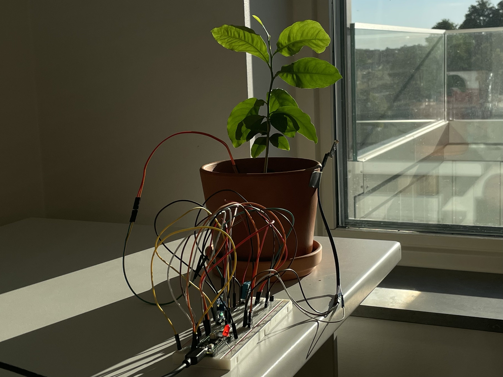
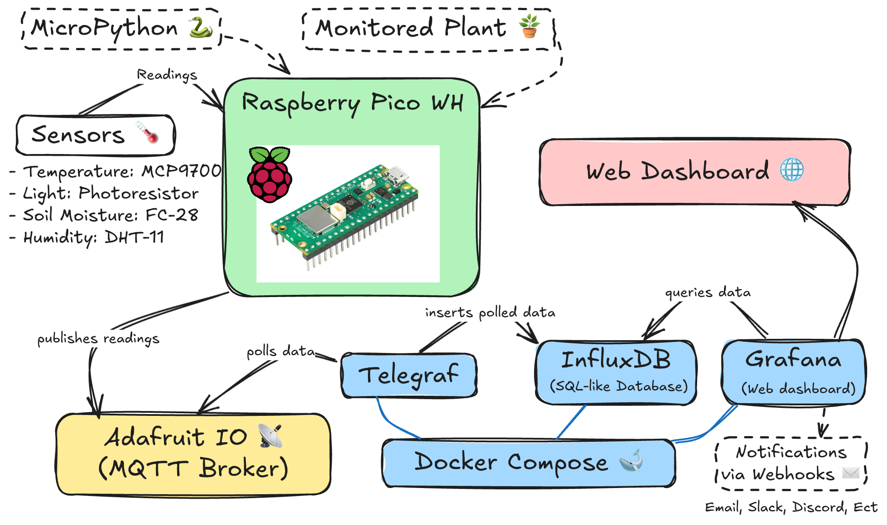
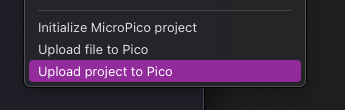
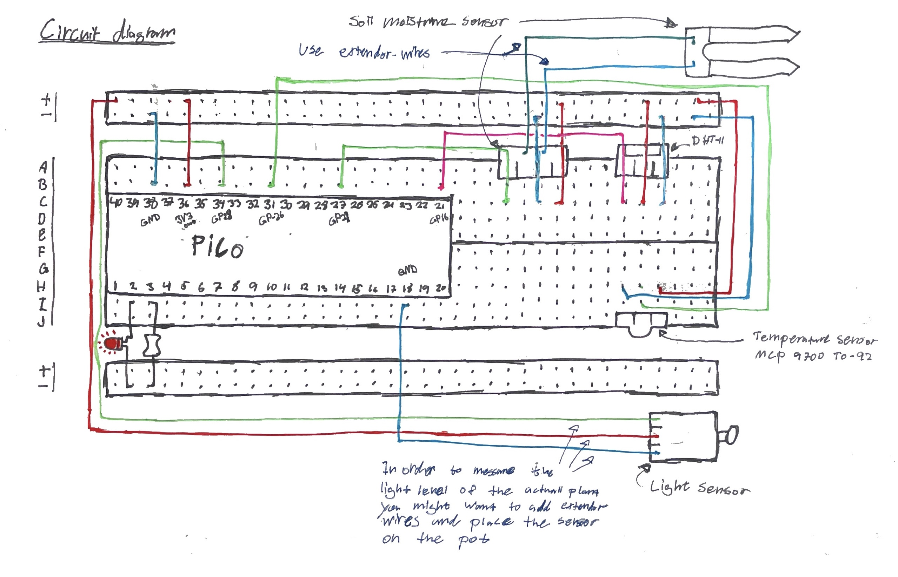
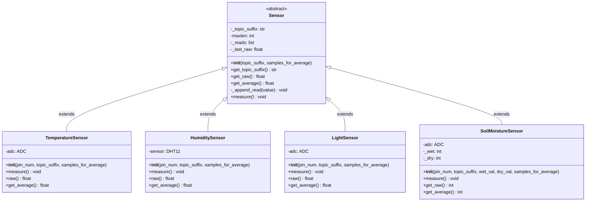
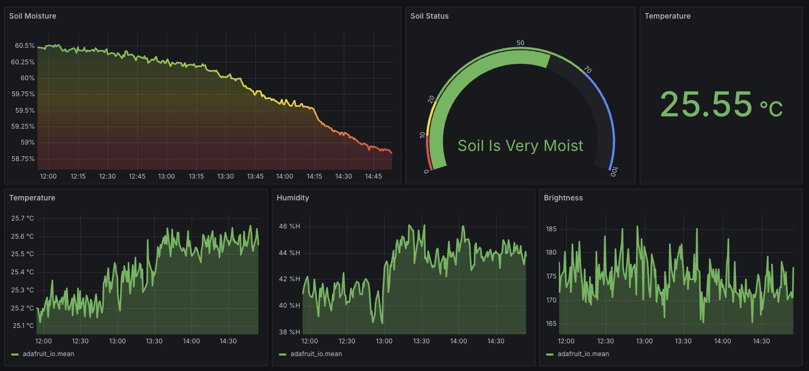
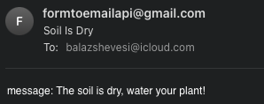

# How To Build A Plant Environment Monitoring System

By: Balazs Hevesi bh222pv

Replicating this system should take around 8 hours (depending on experience and any unforeseen issues).




## Overview

Managing a collection of houseplants can quickly become overwhelming, each one has its own ideal temperature, humidity, light level, and watering schedule.

This system takes the guesswork out of plant care by tracking key environmental factors; air temperature, humidity, light intensity, and soil moisture all in real time via an intuitive graphical dashboard.

It also allows for notifications via webhooks when conditions fall outside your chosen thresholds.

## Objective

I chose to build this system because I have started getting into the hobby of collecting plants and I thought it would be interesting to have some insight on their environment and find potential correlations between the data and the well-being of the plants. This could help with finding out how often and how much the plant should be watered, how much sunlight it should be exposed to, and what temperatures it should be kept at, thus removing the guesswork and improving it’s chances at, not only surviving, but also thriving.

Although I am not new to programming, I have never worked with IoT systems before. This project gave me an insight into the following: analog and digital signals, communication protocols like MQTT, programming of persistent embedded systems, plus more.

## Materials

To build this system you will need the following:

| Hardware                                           | Description                                                                                                   | Image                                                                                                                   | Links                                                                                            |
| -------------------------------------------------- | ------------------------------------------------------------------------------------------------------------- | ----------------------------------------------------------------------------------------------------------------------- | ------------------------------------------------------------------------------------------------ |
| **PC for development and debugging**               | You will need a computer to configure the microcontroller, and debug any potential issues you might run into. |                                                                                                                         | [Electrokit – 99 SEK](https://www.electrokit.com/raspberry-pi-pico-wh)                           |
| **Raspberry Pico WH**                              | Interacts with the sensors and then transmits the data.                                                       |  | [Electrokit – 99 SEK](https://www.electrokit.com/raspberry-pi-pico-wh)                           |
| **DHT-11 Digital Temperature and Humidity Sensor** | Digital sensor, used to get humidity readings.                                                                |                                  | [Electrokit – 49 SEK](https://www.electrokit.com/digital-temperatur-och-fuktsensor-dht11)        |
| **MCP9700 TO-92**                                  | Analog sensor which is used to get temperature readings.                                                      |                                      | [Electrokit – 11.50 SEK](https://www.electrokit.com/mcp9700a-to-92-temperaturgivare)             |
| **Light Sensor**                                   | Analog sensor, used to get light readings.                                                                    |                       | [Electrokit – 39 SEK](https://www.electrokit.com/ljussensor)                                     |
| **FC-28 Soil Moisture Sensor**                     | Analog sensor, used to get soil moisture readings.                                                            |                     | [Electrokit – 29 SEK](https://www.electrokit.com/jordfuktighetssensor)                           |
| **USB-A to Micro-USB Cable**                       | Cable needed to power the microcontroller, as well as flash firmware and transfer the code to the device.     | N/A                                                                                                                     | [Electrokit – 35 SEK](https://www.electrokit.com/en/usb-kabel-a-hane-micro-b-5p-hane-1m)         |
| **Breadboard (840 tie-points)**                    | Used to build the system circuits without soldering anything nor printing a PCB board.                        |                      | [Electrokit – 69 SEK](https://www.electrokit.com/en/kopplingsdack-840-anslutningar)              |
| **Jumper Wires Male-Male**                         | Used for connecting the sensors of the system.                                                                |                         | [Electrokit – 52 SEK](https://www.electrokit.com/en/labbsladd-20-pin-15cm-with-dupont-male/hane) |
| **Jumper Wires Male-Female**                       | Used for connecting the sensors of the system whilst allowing the location of the sensor to be flexible.      |                       | [Electrokit – 49 SEK](https://www.electrokit.com/en/labbsladd-20-pin-15cm-hona/hane)             |
| **Resistor 10 kΩ**                                 | Used to power the blinking LED light.                                                                         |          | [Electrokit – 1 SEK](https://www.electrokit.com/en/motstand-kolfilm-0.25w-10kohm-10k)            |

## Computer Setup

To develop and set up this project I used a Macbook Air M2 (8GB Memory, 256GB storage), running macOS Sonoma (14.5). My code editor of choice was VSCode. An essential extension in my workflow was MicroPico (by paulober), it helped me connect to the microcontroller as well as upload the python files for execution.

The computer setup I used isn’t the most performant nor the most flexible, but it is fairly popular, thus making debugging and troubleshooting a breeze. This allowed me to focus more on the code and the development of the project rather than being bogged down by my choice of tools.

The computer, operating system and any additional pieces of software you choose to use is mostly irrelevant for the setup of this project, as long you’re able to:

1. Write and debug python code
2. Connect to the Pico
3. Upload the python files to the Pico

Then you should be good!

The following step-by-step tutorial assumes that you're using VSCode (or some fork of it like VSCodium, Windsurf, or Cursor)

### Step 1: Setup Development Environment

> These steps assume you’re on Windows/macOS/Linux. Paths and commands may vary slightly.

1. **Download VS Code**

   [Visual Studio Code website](https://code.visualstudio.com/) and click **Download** for your operating system.

2. **Install VS Code**

   - **Windows:** Run the downloaded `.exe` installer and follow the prompts.
   - **macOS:** Open the `.dmg`, drag “Visual Studio Code” into your Applications folder.
     - Alternatively, run `brew install --cask visual-studio-code`
   - **Linux:** Use your distro’s package manager or download the `.deb`/`.rpm` package.

3. **Install the MicroPico extension**

   1. Open VS Code.
   2. Click the Extensions icon (or press `Ctrl+Shift+X` / `⌘+Shift+X`).
   3. Search for MicroPico (by paulober) and click "Install".

4. **Download the MicroPython firmware**

   1. In your browser, go to the [MicroPython downloads for Raspberry Pi Pico](https://micropython.org/download/rp2-pico/).
   2. Download the latest `.uf2` file.

5. **Put your Pico into BOOTSEL mode**

   1. Hold down the BOOTSEL button while plugging it into your computer.
   2. A new removable drive (“RPI-RP2”) will appear.

6. **Install (flash) the firmware onto the Pico**

   1. Drag-and-drop the downloaded `.uf2` file onto the “RPI-RP2” drive.
   2. The drive will disappear and the Pico will reboot running MicroPython.

7. **Connect to the Pico from within VS Code**

   1. In VS Code’s Command Palette (`Ctrl+Shift+P` / `⌘+Shift+P`), type and select `MicroPico: Connect`.

8. **Run a Python file on the Pico**

   1. Open your `.py` script in VS Code.
   2. With your script open, use click the "Run" button (looks like a triangle) in the status bar.
   3. It will copy the file to the Pico’s filesystem and run it .

9. **Upload a folder (project) to the Pico**
   1. Open the file tree view in the sidebar.
   2. Right click the folder you wish to upload.
   3. This will copy over your local folder (all `.py` files) onto the Pico, useful for larger projects.
      

### Step 2: Setup Docker

> This part describes the setup of Docker compose, which will be used to run the TIG-Stack: the Telegraf, (used to poll data), InfluxDB (for the storing of data), and Grafana (web dashboard).

1. **Install Docker Engine & Docker Compose**

   - **Windows/macOS:**
     1. Download and install Docker Desktop from https://www.docker.com/get-started.
     2. Follow the on-screen installer prompts and reboot if prompted.
   - **Linux (Ubuntu/Debian example):**
     ```bash
     sudo apt-get update
     sudo apt-get install -y docker.io docker-compose
     sudo usermod -aG docker $USER      # so you can run `docker` without sudo
     newgrp docker                      # apply the new group membership
     ```
   - Verify installation:
     ```bash
     docker --version
     docker-compose --version
     ```

2. **Write the `docker-compose.yml` file**

   1. In your project root, create a file named `docker-compose.yml`.
   2. Paste in the following (omit any real API-keys or passwords—replace them with environment variables or Docker secrets in production):

      ```yaml
      version: "3"

      networks:
        tig-net:
          driver: bridge

      services:
        influxdb:
          image: influxdb:1.8
          container_name: influxdb
          ports:
            - "8086:8086"
          environment:
            INFLUXDB_DB: "telegraf"
            INFLUXDB_ADMIN_ENABLED: "true"
            INFLUXDB_ADMIN_USER: "telegraf"
            INFLUXDB_ADMIN_PASSWORD: "<your-password-here>"
          networks:
            - tig-net
          volumes:
            - ./data/influxdb:/var/lib/influxdb

        grafana:
          image: grafana/grafana:latest
          container_name: grafana
          ports:
            - "3000:3000"
          environment:
            GF_SECURITY_ADMIN_USER: admin
            GF_SECURITY_ADMIN_PASSWORD: admin
          volumes:
            - ./data/grafana:/var/lib/grafana
          networks:
            - tig-net
          restart: always

        telegraf:
          image: telegraf:latest
          depends_on:
            - influxdb
          environment:
            HOST_NAME: "telegraf"
            INFLUXDB_HOST: "influxdb"
            INFLUXDB_PORT: "8086"
            DATABASE: "telegraf"
          volumes:
            - ./telegraf.conf:/etc/telegraf/telegraf.conf:ro
          networks:
            - tig-net
          restart: always
      ```

   3. Save the file.

3. **Write the `telegraf.conf` file**

   1. In the same directory, create `telegraf.conf`.
   2. Paste in your Telegraf configuration, for example:

      ```toml
      [agent]
        interval = "15s"
        flush_interval = "15s"

      [[inputs.mqtt_consumer]]
        name_override = "adafruit_io"
        servers       = ["tcp://io.adafruit.com:1883"]
        topics        = [
          "Balazs1/feeds/iot.temperature/json",
          "Balazs1/feeds/iot.humidity/json",
          "Balazs1/feeds/iot.brightness/json",
          "Balazs1/feeds/iot.soil-moisture/json",
        ]
        client_id       = "telegraf-adafruit"
        username        = "<your-username>"
        password        = "<your-aio-key>"
        data_format     = "json_v2"

        [[inputs.mqtt_consumer.json_v2]]
          measurement_name_path = ""
          timestamp_path        = "data.created_at"
          timestamp_format      = "2006-01-02T15:04:05Z07:00"

          [[inputs.mqtt_consumer.json_v2.field]]
            path = "data.value"
            type = "float"

          [[inputs.mqtt_consumer.json_v2.tag]]
            path = "key"
            type = "string"

      [[outputs.influxdb]]
        urls     = ["http://influxdb:8086"]
        database = "telegraf"
        username = "telegraf"
        password = "<your-password-here>"
      ```

   3. Replace all placeholder values (`<your-aio-key>`, `<your-password-here>`, etc.) with your own credentials or environment‐variable references.

4. **Run the TIG-Stack**
   1. In your project directory, start all services:
      ```bash
      docker-compose up -d
      ```
   2. Check that containers are running:
      ```bash
      docker ps
      ```
   3. Tail the logs if you need to debug Telegraf or InfluxDB:
      ```bash
      docker-compose logs -f telegraf influxdb
      ```
   4. Open your browser and verify:
      - **Grafana** at http://localhost:3000 (login: `admin`/`admin`)
      - **InfluxDB** API at http://localhost:8086 (you can query the `telegraf` database)

## Putting everything together


Circuit diagram over the wiring of the microcontroller.

## Platform

My system makes use of 4 different platforms which all need to be hosted.

Firstly there’s Adafruit IO. It’s used as an MQTT broker where the IoT devices send their readings to. Although it is open-source and therefore can be self-hosted, I chose to simply use their free tier instead. It works fine, although it does have rate limiting which is fairly easy to run into. Upgrading to a paid tier might be worth it if you want to publish the readings more frequently.

The second service I make use of in the system is influxDB. It's a SQL-like database but made specifically to deal with time series data (like readings form an IoT device). Since I already have some experience with SQL I thought it would make a great fit in the stack.

The third service I make use of is Telegraf. Essentially, It’s used to poll the Adafruit IO feed and insert the data into InfluxDB.

The fourth service I use is Grafana. Grafana is a dashboard-building tool. It integrates well with influxDB, which is exactly why I chose it.

InfluxDB, Telegraf, and Grafana are hosted locally on my machine with the help of docker compose. I would’ve liked to use something like railway.app to host it instead, but due to time constraints i couldn’t. Another interesting idea could’ve been to self-host all of the services on something like a Raspberry Pi, that way i would have more control over the whole process.

The Code

The code for this project is available in the Github repo in “src/”. It isn’t overly simple, but also not extremely complex.

Turns out MicroPython doesn’t have an MQTT library built in, and it’s not possible to do “pip” installs on a microcontroller, so my best bet was to simply copy paste a the file from the python library know as “umqtt.simple” to get MQTT connectivity working.

Although I generally like to stay away from using inheritance and classes (because it can cause unnecessary complexity), I thought that using object oriented principles could actually be a really nice fit for this project. I chose to think of the sensors as classes. Firstly I use a “Sensor” superclass which all of the different sensor classes then get to inherit from. This superclass defines methods such as “measure” and “get_average”. This ensures that we can always call the “measure” method on all sensors, this is pretty nice for simplifying the code. Below is a UML diagram over the code.



Because Adafruit imposes rate limitations, we cannot publish our readings as often as we can take readings. To (somewhat) remedy this; I chose to keep an average of the last 30 readings for each sensor, and then only actually publish the average. The logic for keeping the averages is handled by the Sensor classes.
The sensor superclass stores the last 30 readings in a deque data structure. I specifically chose to make use of a deque instead of python's array. I chose this because it’s technically faster (Although since we’re only storing the last 30 values it might not be a big deal). In the deque data structure, appending and popping are both constant time operations (and we do alot of that) whereas with an array popping is an O(n) time operation.

Furthermore I chose to implement a type of “Event loop” into my program (perhaps the term “Event loop” is inaccurate, i don’t know). It allows me to have more flexibility with the main loop of the program, not every operation needs to adhere to the main loop's sleeping-time.

Below is an example of how i use it in `main.py`

```py
EVENT_LOOP_TICK_DURATION_MS = 1000
PUBLISH_TICK_INTERVAL = 30
print("starting event loop...")
event_loop = EventLoop([], EVENT_LOOP_TICK_DURATION_MS)
event_loop.add_item(EventLoopItem(led.toggle, interval_ticks=1))
event_loop.add_item(EventLoopItem(measure, interval_ticks=1))
event_loop.add_item(EventLoopItem(publish, interval_ticks=PUBLISH_TICK_INTERVAL))
event_loop.start()
```

We start by instantiating the event_loop and giving it duration. This tells the program how often it should run the eventloop.
Then we append the EventLoopItems, we start by adding “led.toggle” and we give it an interval_tick of “1”. This means that it will run every time the eventloop runs. So if the event_loop runs every 1000ms, then the led will toggle every 1000ms.
Then we run “measure” which takes measurements of all sensors, this will also happen every time the event loop runs
Finally we add “publish” which will publish the readings. This only happens every 30 runs of the event loop. So if each run takes 1000ms, then we would only run “publish” every 1000ms \* 30 = 30s, this is done to avoid running into rate limits.

I also wanted to call webhooks in case the solid moisture went under a certain threshold, but later on in the development I found that that could actually also be implemented though Grafana’s notification system, so that’s what I used.

## Transmitting the data

The data is being transmitted every 30s. This can be adjusted pretty easily by changing the “EVENT_LOOP_TICK_DURATION_MS” and “PUBLISH_TICK_INTERVAL” constants in “main.py ”. I chose 30s in order to not run into adafruit's rate limiting. Although I am transmitting the data only every 30s, the data being transmitted is actually an average of measurements taken every second since the last transmission.

I chose to use WiFi as my wireless protocol as it is sufficient for my use case. I don’t need long range connectivity.

For my transport protocol I went with MQTT, although HTTP could’ve also been a good alternative.

## Presenting the data

Data is added to the database every 15s (this is defined in the `telegraf.conf` file)

I used grafana to build the dashboard which presents the data.



Grafana provides an alert system which i made use of to call webhooks.


Firstly, the contact point needs to be added.


Then we need to create an alert rule which will call on the contact when a defined criteria is met (the soil is dry).


For now; i have it setup so that it invokes a webhook which then sends me an email.

## Finalizing the design


Picture of the system being hooked up to my (baby) lemon tree.

If i had more time to work on this project i would definitely change some aspects of it.
Firstly, i would try to self-host everything. I don't have much experience self-hosting, but i think it would be a great opportunity to learn. I think it would be sick to be able to access the grafana dashboard and look at how my plants are doing even when im not home.

Secondly, im not a huge fan of low-code tools. Even though grafana turned out to be alright to work with, i would've liked to build my own dashboard with javascript.

Overall, I am pretty happy with how the project turned out.
