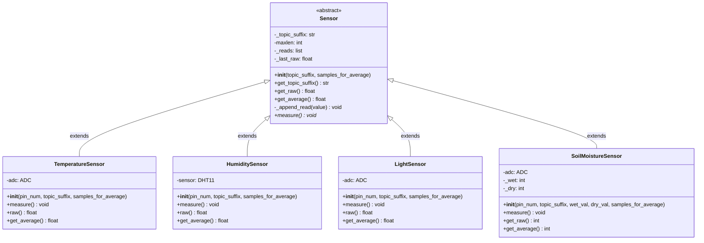

# Sensor Classes UML Diagram

## Class Descriptions

### Sensor (Abstract Base Class)

- **Purpose**: Base class for all sensor implementations
- **Key Features**:
  - Manages topic suffixes for MQTT publishing
  - Implements averaging functionality with configurable sample size
  - Provides abstract `measure()` method that subclasses must implement
  - Stores raw readings and calculates averages

### TemperatureSensor

- **Purpose**: Measures temperature using ADC
- **Hardware**: Uses ADC pin for analog temperature sensor
- **Output**: Temperature in Celsius (converted from voltage)

### HumiditySensor

- **Purpose**: Measures humidity using DHT11 sensor
- **Hardware**: Uses DHT11 digital sensor
- **Output**: Humidity percentage

### LightSensor

- **Purpose**: Measures light intensity using photoresistor
- **Hardware**: Uses ADC pin with photoresistor
- **Output**: Raw ADC values (0-65535)

### SoilMoistureSensor

- **Purpose**: Measures soil moisture content
- **Hardware**: Uses ADC pin with soil moisture sensor
- **Output**: Moisture percentage (0-100), where 100 = submerged in water, 0 = completely dry
- **Special Features**: Configurable wet/dry calibration values
